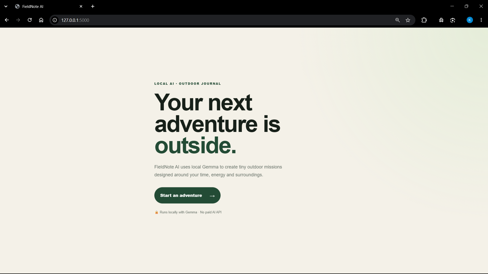
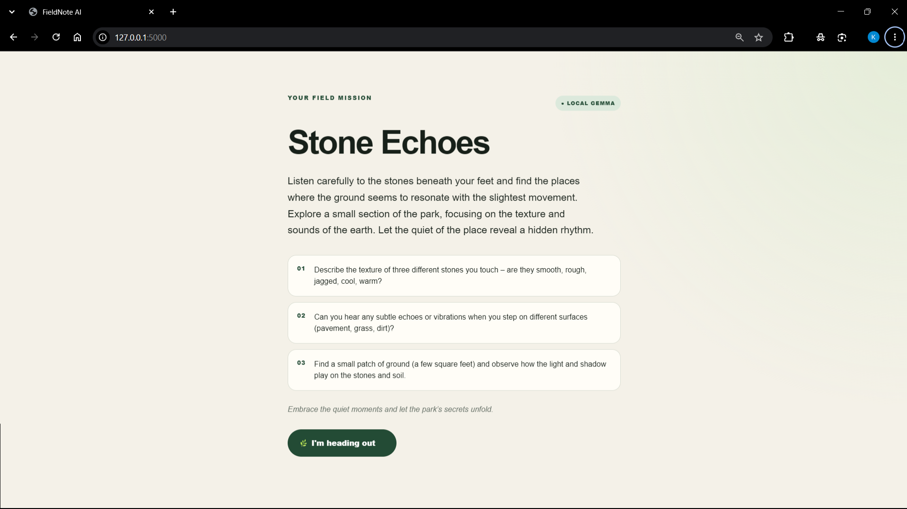

# 🌿 FieldNote AI

> A local-AI micro-adventure journal designed to get people off their screens and back into the real world.

FieldNote AI uses **Google Gemma 3 locally through Ollama** to create personalized outdoor missions based on your available time, energy, and surroundings.

The goal is simple:

**Spend less time looking at your screen. Notice more of the world around you.**

---

## ✨ What It Does

FieldNote AI turns a few simple choices into a small real-world adventure.

### 1. Plan

Choose:

- Available time
- Energy level
- Outdoor setting

Gemma generates a personalized outdoor mission based on your choices.

### 2. Go Outside

The app enters **Screen Exit Mode**.

You are explicitly encouraged to put your phone away and complete the mission in the real world.

### 3. Observe

The mission provides three observation challenges designed to encourage curiosity and attention.

### 4. Reflect

After returning, write a short reflection about what you actually noticed.

### 5. Keep the Memory

Local Gemma transforms your reflection into a short, polished field note.

---

## 🤖 Why Gemma?

FieldNote AI uses **Gemma 3:4b locally through Ollama**.

This means the core AI generation happens on the user's own machine.

- No paid AI API is required.
- No cloud AI account is required.
- No personal outdoor experience needs to be sent to a remote AI service.
- AI generation works locally through Ollama.

The project demonstrates how local AI can be used for something intentionally different:

**AI that helps you leave the screen instead of keeping you on it.**

---

## 🔒 Privacy First

FieldNote AI follows a local-first approach.

- AI generation runs locally through Ollama.
- No paid AI API.
- No user account required.
- No analytics system.
- Photos are handled locally in the browser.
- Personal reflections do not need to be uploaded to a cloud AI service.

Your field note starts with your real-world experience, not a cloud database.

---

## 🛠️ Tech Stack

### Frontend

- HTML
- CSS
- JavaScript

### Backend

- Python
- Flask

### AI

- Google Gemma 3:4b
- Ollama

---

## 🏗️ How It Works

```text
User Choices
     │
     ▼
Flask Backend
     │
     ▼
Local Gemma 3:4b
     │
     ▼
Outdoor Mission
     │
     ▼
Screen Exit Mode
     │
     ▼
Real-World Observation
     │
     ▼
User Reflection
     │
     ▼
Local Gemma 3:4b
     │
     ▼
Personalized Field Note
```

The application has two main AI interactions:

1. **Mission Generation**  
   Gemma creates a small outdoor activity based on the user's time, energy, and environment.

2. **Field Note Generation**  
   Gemma turns the user's actual reflection into a concise field note while staying grounded in the details the user provided.

---

## 📸 Screenshots

### Landing Page



### Generated Mission



### Screen Exit Mode


### Final Field Note


> **Note:** Make sure the screenshot filenames above exactly match the files inside the `screenshots/` folder.

---

## 🚀 Run Locally

### Prerequisites

Make sure you have:

- Python 3.10+
- Git
- Ollama
- Gemma 3:4b

### 1. Clone the repository

```bash
git clone https://github.com/Yadnu14/FieldNote-AI.git
cd FieldNote-AI
```

### 2. Create a virtual environment

```powershell
python -m venv venv
```

### 3. Activate the virtual environment

```powershell
.\venv\Scripts\Activate.ps1
```

### 4. Install dependencies

```powershell
pip install -r requirements.txt
```

### 5. Make sure Gemma is available through Ollama

```powershell
ollama pull gemma3:4b
```

### 6. Start the application

```powershell
python app.py
```

### 7. Open the application

Visit:

```text
http://127.0.0.1:5000
```

Make sure Ollama is running locally before generating missions or field notes.

---

## 🌱 The "Touch Grass" Principle

Most AI applications are designed to increase the amount of time people spend interacting with technology.

FieldNote AI intentionally goes in the opposite direction.

The application uses AI to create a reason to:

**Close the laptop.  
Put the phone away.  
Go outside.  
Pay attention.**

The AI interaction is only the beginning. The actual experience happens away from the screen.

---

## 🎯 Challenge Goals

FieldNote AI was created around the idea of using local AI to encourage real-world exploration and reflection.

The project demonstrates:

- Local AI inference with Gemma
- Practical use of Ollama
- AI-assisted activity generation
- Privacy-conscious local processing
- A simple Flask + JavaScript architecture
- Human interaction with the physical world
- AI used as a tool rather than the destination

---

## 🔮 Future Ideas

Possible future improvements include:

- Saving completed field notes locally
- A personal collection of past adventures
- More mission types
- Difficulty and accessibility options
- Weather-aware missions using optional local data
- Offline-first progressive web app support
- Exporting field notes as a journal
- Additional local Gemma models

These ideas are intentionally kept outside the current core experience so that the project remains simple and focused.

---

## 📁 Project Structure

```text
FieldNote-AI/
│
├── app.py
├── requirements.txt
├── README.md
├── .gitignore
│
├── templates/
│   └── index.html
│
├── static/
│   ├── app.js
│   └── style.css
│
└── screenshots/
    ├── landing.png
    ├── mission.png
    ├── outside-mode.png
    └── field-note.png
```

---

## 🔐 Local AI Architecture

FieldNote AI communicates with Ollama through its local API.

```text
Browser
   │
   ▼
Flask Application
   │
   ▼
Ollama Local API
   │
   ▼
Gemma 3:4b
   │
   ▼
Generated Response
   │
   ▼
Browser
```

No external AI API is required for the core functionality.

---

## 👨‍💻 Built By

**Yadnesh Kulkarni**

IT Engineering student exploring:

- Cloud Computing
- DevOps
- Linux
- Python
- AI
- Open Source

Built as an exploration of how local AI can encourage people to spend more time experiencing the real world.
